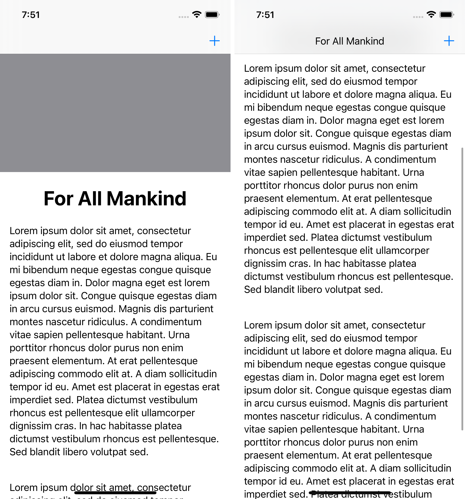

# SwiftUI Matched Inline Title

Transition from any SwiftUI `Text` view into an inline navigation bar title when the view is scrolled off-screen, as seen in Apple's TV & TestFlight iOS apps.

## Example

```swift
struct ContentView: View {
    
    @Namespace var namespace
    
    var body: some View {
        NavigationView {
            ScrollView {
                VStack(alignment: .leading) {
                    MatchedTitle("For All Mankind", namespace: namespace) {
                        $0
                            .font(.largeTitle)
                            .fontWeight(.bold)
                            .padding()
                    }

                    // Other content…
                }
            }
            .matchedInlineTitle(in: namespace)
            // Other view modifiers, including `Toolbar` can be used…
        }
    }
}
```



Naming and namespacing conventions follow Swift's existing `.matchedGeometryEffect` view modifier.

A `MatchedTitle` view is initialized with any `String`, `SubString` or `LocalizedStringKey`, using similar parameters to SwiftUI's `Text`, and it provides optional customisation of the created `Text` view.

The `.matchedInlineTitle` modifier must be used on a `ScrollView`, and enforces a navigation bar title display mode of `inline`.

## Minimum Requirements

* iOS 14.0
* Swift 5.3

## License

This library is released under the MIT license. See the [LICENSE](LICENSE) file for more information.
